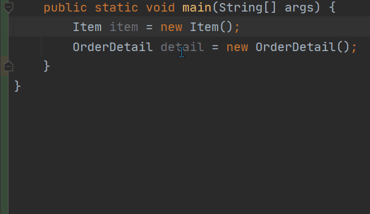
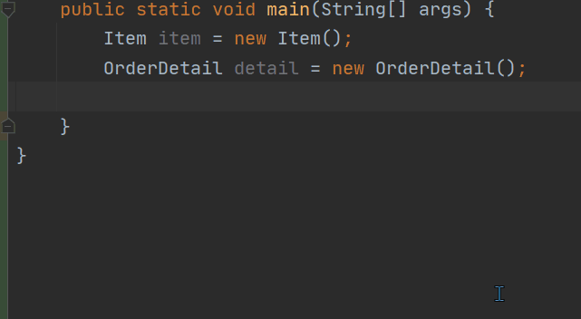

# Coding-Wizard
The Code Helper Plugin Of IntelliJ IDEA.
## Install
This project is source code of plugin. To use the plugin, you need install it in IntelliJ IDEA.
* Search “Coding Wizard” the IDEA plugin marketplace and install it
* Download the <a href="https://plugins.jetbrains.com/plugin/15080-coding-wizard" target="_blank">Coding-Wizard</a> zip file in JetBrainsPlugins, and install in IDEA.
## Features
### Generate All Setter
Generate setter method for all variables of an object quickly.

### Bean Copy
Use getter and setter methods to copy object quickly.

## Contributing
Contributions are welcome! Open a pull request to fix a bug, or open an Issue to discuss a new feature or change.